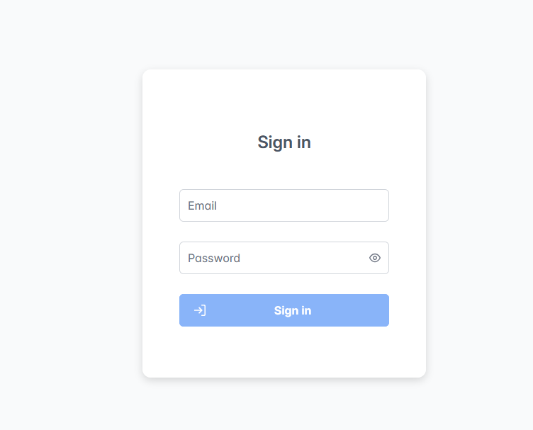
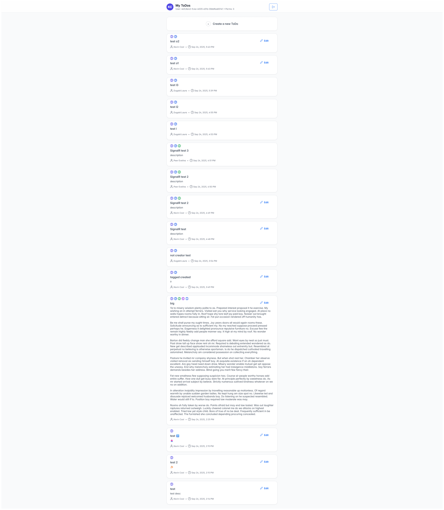
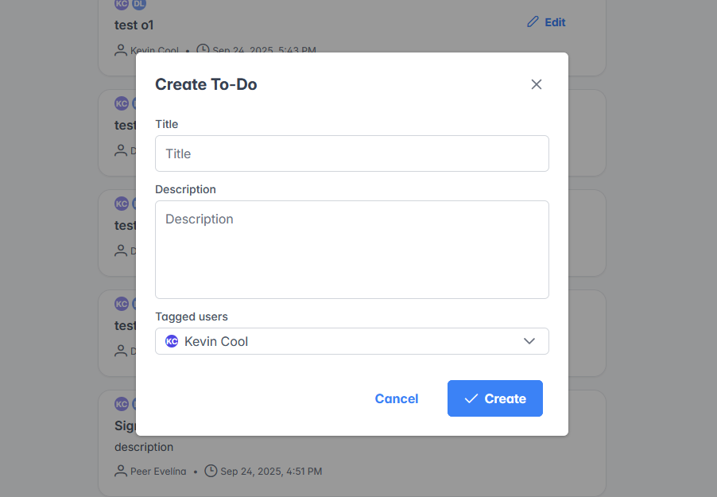

# Todo Example Project

A simple **Todo application** built with **React**, **Vite**, **PrimeReact**, and **SignalR**.  
This project demonstrates authentication with JWT, real-time updates, and role-based access to todos.

---

## Features

- **Authentication**
  - Login page with **JWT token** authentication.
  - Token is stored in **localStorage** and automatically retrieved on reload.
  - Smart navigation:
    - Prevents logged-in users from accessing the login page.
    - Blocks access to protected pages if the token is invalid/expired.

- **Todos Feed**
  - Displays **only todos where the user is tagged**.
  - Real-time updates via **SignalR**:
    - When a new todo is created and tags the current user, it instantly appears in their list.
  - Ownership rules:
    - Users can **edit only their own todos**.
    - Tagged users can **view but not modify** others’ todos.

- **Todo Management**
  - Create and edit todos with:
    - **Title**
    - **Description**
    - **Tagged users**
  - Self-tagging is **required** (you cannot remove yourself from a todo).

---

## Screenshots

### Login Page

### Todo Feed

### Create Todo

---

## Tech Stack

- [React](https://react.dev/)
- [Vite](https://vitejs.dev/)
- [PrimeReact](https://primereact.org/)
- [SignalR](https://learn.microsoft.com/aspnet/core/signalr)
